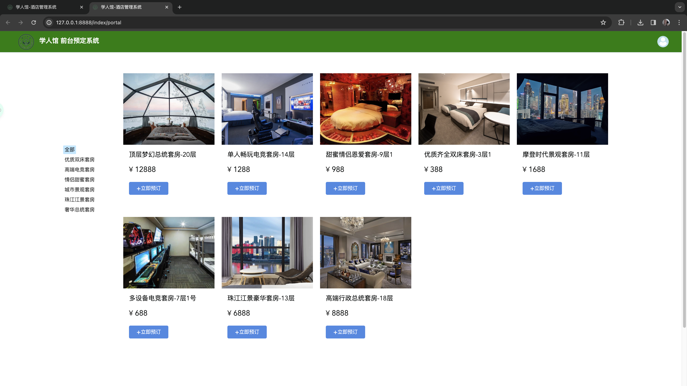
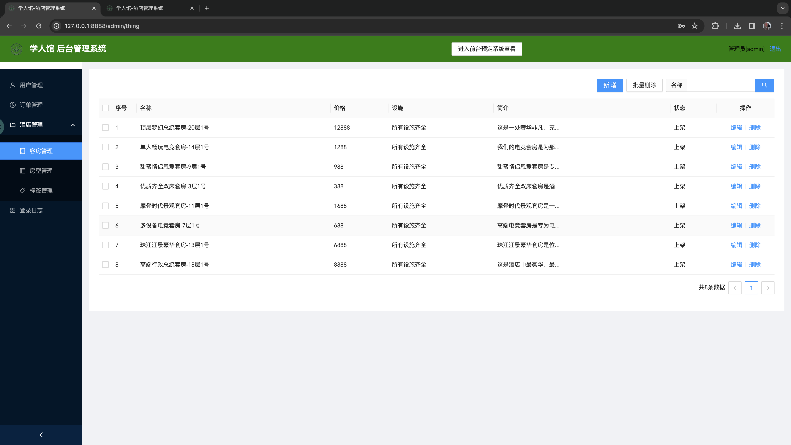

## 酒店前台预订和后台管理系统

### 项目demo访问地址：

+ 前台：http://hotelmanage.nat300.top/index/portal (登陆帐号密码均：james）

+ 后台：http://hotelmanage.nat300.top/admin/thing （登陆帐号密码均：admin）

### 项目部分效果展示

+ 登陆页面：


+ 前台主页：



+ 后台客房管理：


<<<<<<< HEAD


=======
<<<<<<< develop
>>>>>>> 2ba43bf9b86b2f57a492a2efd1d5c7bf47b3d591

### Docker 自动部署：

##### 确保目标部署服务器已安装 Docker 和 Docker Compose。

+ 安装 Docker

```bash
$ sudo apt update
$ sudo apt install -y docker.io
$ sudo systemctl start docker
$  sudo systemctl enable docker
```

+ 安装 Docker Compose

```bash
$ sudo apt install -y docker-compose
```

##### 下载源码

```bash
$ git clone git@github.com:02lb/HotelSystem.git
$ cd HotelSystem
```

##### 配置环境变量

+ 在项目根目录下创建 `.env` 文件，根据需要设置环境变量。

```bash
MYSQL_ROOT_PASSWORD=libo8657
DB_NAME=python_hotel
DB_USER=hotel_admin
DB_PASSWORD=hotel0601
```

##### 构建和启动容器进行部署

```bash
$ docker-compose up -d --build
```
<<<<<<< HEAD
=======

=======
>>>>>>> main
>>>>>>> 2ba43bf9b86b2f57a492a2efd1d5c7bf47b3d591
