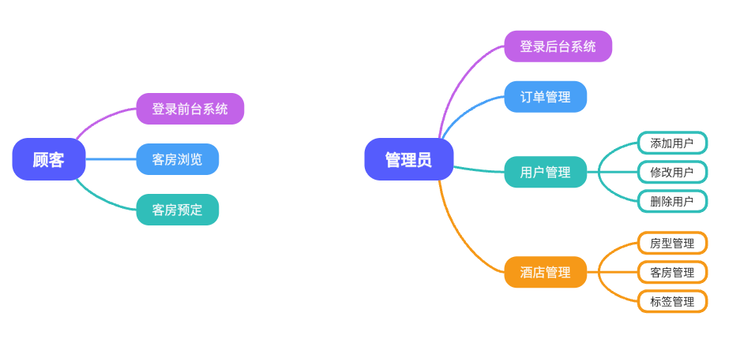
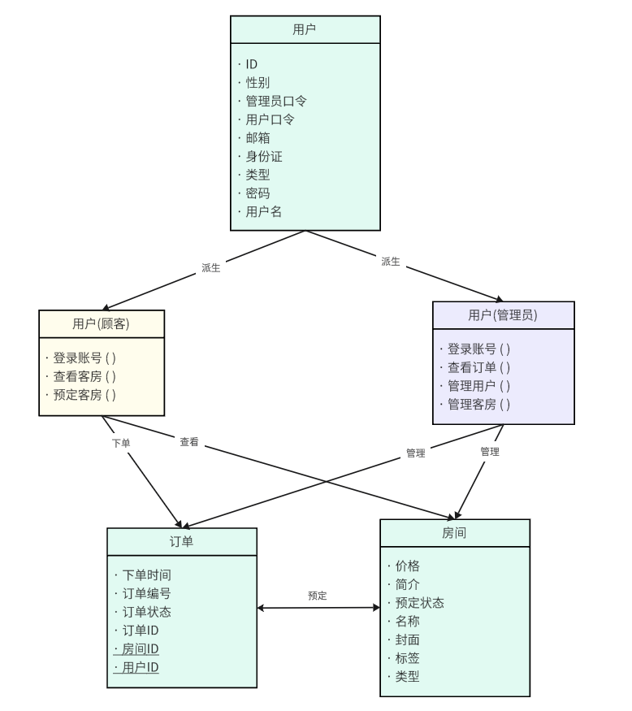
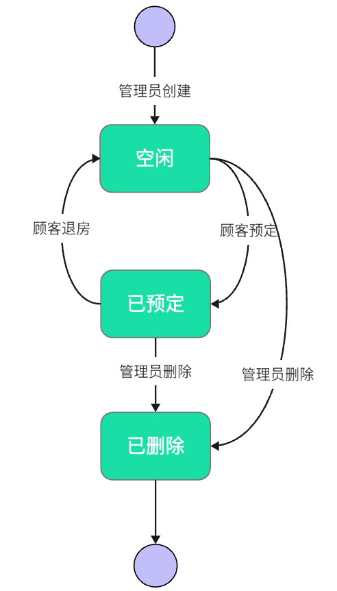
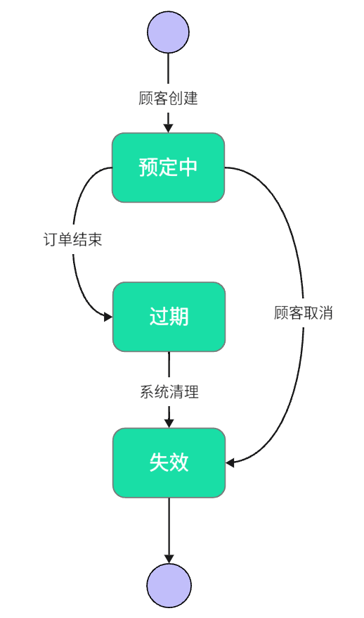
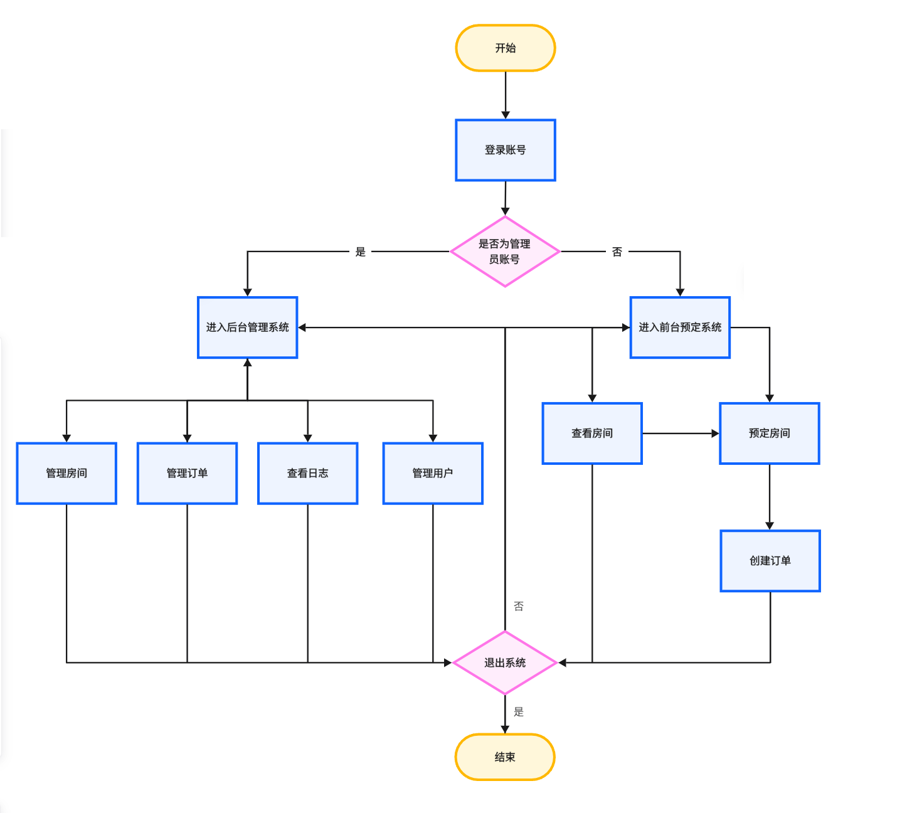

# 系统建模文档

| 修改人 | 修改内容         | 修改原因 | 版本信息 | 修改日期 |
| ------ | ---------------- | -------- | -------- | -------- |
| 游少濠 | 完成系统建模文档 | -        | v1.0     | 2024/6/7 |

## 用例分析

>角色定义
>1. 顾客 : 使用本系统进行酒店预约的使用者
>2. 管理员 : 负责管理本系统，为用户提供服务并对系统进行维护的酒店工作人员

本项目的基础的需求分析是构建一个安全、易用且具有扩展性的酒店预定和管理系统。

作为酒店顾客，可以使用有效的用户名和密码登录酒店的前台预定系统；浏览可用房间的详细信息，包括房间类型、价格、简介；顾客可以选择并预订可用的房间。

作为酒店管理员，可以使用专用的用户名和密码账户登录酒店的后台管理系统；添加、修改和删除系统中的用户，包括其他管理员和顾客；也可以添加、修改和删除酒店房间的信息，包括房间类型、价格、标签等；查看所有订单的状态等。

    图一 : 用例图

## 静态模型

### 类图
本项目中所使用的类分别为：
> 用户
> > 类型1：顾客
> >
> > 类型2：管理员
> 
> 房间
> 
> 订单
>

定义用户(顾客)、用户(管理员)、房间以及订单类及其关系如下：

顾客在前台进行登录、看房、预定的操作，访问房间类和订单类。通过创建订单类预定房间。

管理员在后台进行登录、管理房间与订单的操作，对已有的房间和订单实体进行修改或者创建新的房间对项目进行管理。

    图二 : UML图

​    

### 状态图

#### 房间
酒店房间由管理员创建后初始处于空闲状态。顾客通过发起订单预定房间，待到退房时系统将房间置为为空闲。同时，管理员可以将酒店房间删除，此时房间进入已删除状态，从系统中移除。

    图三 : 房间状态图

#### 订单

订单由顾客创建。在订单有效期内，顾客可以取消订单使订单变为失效状态。订单有效期结束后，订单会被置为过期状态后失效。

    图四 : 订单状态图

## 动态模型

### 活动图

用户访问本系统的活动流程设计图如下：

    图五 : 用户活动图

​    

