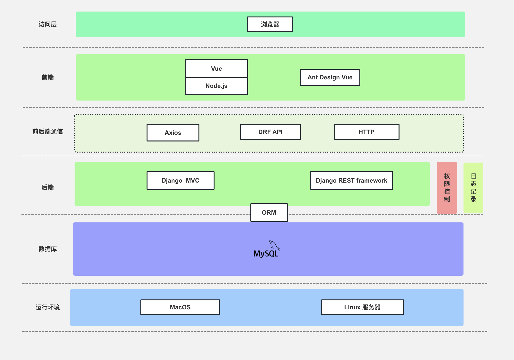
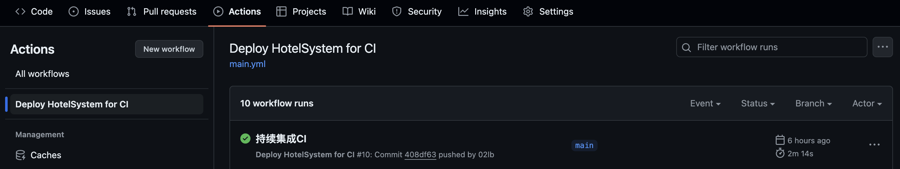

<h1><center>软件配置与运维文档</center></h1>

| 修改人 | 修改内容                       | 修改原因                           | 版本信息 | 修改日期 |
| ------ | ------------------------------ | ---------------------------------- | -------- | -------- |
| 李博   | 完成第一版初稿框架一级配置管理 | -                                  | v1.0     | 24/6/4   |
| 李博   | 完成版本控制内容               | 实施版本控制                       | v1.1     | 24/6/10  |
| 李博   | 完成部署说明相关内容           | 项目基础搭建玩完成，可以自动化部署 | v1.2     | 24/6/11  |

### 1. 引言

####  1.1 编写目的

+ 本文档旨在详细说明酒店管理系统的配置管理、版本管理、部署步骤以及运维计划。通过该文档，开发人员、运维人员和相关利益相关者可以更好地理解和管理系统，确保系统的高效开发、部署和稳定运行。

#### 1.2 名词释义

本节对文档中使用到的专用名词进行释义

+ **SCM：**即 Software Configuration Management 软件配置管理，通过版本控制、变更控制等规程和合适的配置管理软件来保证软件配置项完整性和可追溯性的管理方法。
+ **运维：**即DevOps（Development and Operations）是一种软件开发流程和文化，旨在通过自动化和持续集成/持续部署（CI/CD）等实践来加快软件交付速度、提高产品质量和改善团队合作效率。
+ **CI/CD：**即持续集成 持续交付。CI/CD是一种软件开发流程，旨在通过自动化构建、测试和部署，实现快速、高质量和可靠的软件交付。持续集成指开发人员在代码提交到版本控制系统后，自动进行编译、测试和代码检查等操作，以确保代码质量和稳定性。持续交付则是在持续集成的基础上，将代码部署到生产环境，以实现快速、可靠的软件交付。

#### 1.3 预期读者及建议

| 编号 | 预期读者     | 阅读建议                                                   |
| ---- | ------------ | ---------------------------------------------------------- |
| 1    | 小组开发成员 | 着重阅读第二、三、五部分：配置管理、版本管理和持续集成计划 |
| 2    | 小组运维成员 | 着重阅读第五部分：运维说明                                 |
| 3    | 部署相关方   | 着重阅读第四部分：部署说明                                 |
| 4    | 老师         | 审阅本酒店管理系统的软件配置和运维文档的合理性             |


### 2. ==配置管理==

#### 2.1 配置管理概述

+ 配置管理是指对本酒店管理系统中所有配置项（如配置文件、环境变量、依赖库等）进行有效管理，以确保系统在不同环境（开发、测试、生产）中能一致地运行。配置管理的目标是确保系统的配置统一、透明、可追踪和可控。

#### 2.2 配置文件

##### 2.2.1 配置文件结构

+ 对于Django项目后端，配置文件的路径和结构如下：

```
HotelManageSystemBackend/
├── manage.py （Django管理脚本）
├── HotelManageSystemBackend/（Django 项目目录）
│   ├── __init__.py
│   ├── settings.py (**主项目配置文件**)
│   ├── test.py  (测试环境配置文件)
│   ├── urls.py  (主 URL 配置文件)
│   ├── wsgi.py  (WSGI 配置文件)
│   └── asgi.py  (ASGI 配置文件)
└── requirements.txt （项目依赖）
```

对于Vue项目前端，配置文件的路径和结构如下：

```
HotelManageSystemFront/
├── package.json （项目依赖和脚本）
├── package-lock.json （锁定依赖版本）
├── vue.config.js （Vue CLI 配置文件）
└── tsconfig.json （TypeScript 配置文件）
```

##### 2.2.2 配置项说明

每个配置文件的关键配置项说明如下：

+ `settings.py`：
	+ DATABASES：开发环境 Mysql 数据库连接信息（引擎、名称、用户、密码、主机、端口）
	+ DEBUG：调试模式开关（开发环境开启，生产环境关闭）
	+ ALLOWED_HOSTS：允许访问的主机列表
	+ STATIC_URL：静态文件的URL路径
+ `test.py`:
	+ DATABASES：测试环境 Mysql 数据库连接信息（引擎、名称、用户、密码、主机、端口）

+ `urls.py`：
	+ urlpatterns ：配置前台预订系统和后台管理系统的主路由

+ `src/store/constant.js`：
	+ BASE_URL：配置后端API的根路径

#### 2.3 环境配置

##### 2.3.1 开发环境

+ 操作系统：macOS15beta / Ubuntu18.04
+ 数据库：mysql 8.2.0

+ Python版本：后端使用python3.8
+ 虚拟环境：使用 conda 环境
+ 依赖：PyMySQL 1.0.2、Django 3.2.11、djangorestframework 3.13.0等

##### 2.3.2 测试环境

+ 操作系统：macOS15beta / Ubuntu18.04
+ 数据库：mysql 8.2.0

+ Python版本：后端使用python3.8
+ 虚拟环境：使用 conda 环境
+ 依赖：PyMySQL 1.0.2、Django 3.2.11、djangorestframework 3.13.0等

#### 2.4 配置管理工具

+ 版本控制：Git

#### 2.5 配置管理流程

+ **配置项创建**：在开发环境中创建或修改配置文件。
+ **配置项提交**：使用Git进行版本控制，提交到代码仓库。
+ **配置项审查**：通过代码审查流程，确保配置项的正确性。

+ **配置项发布**：将配置项发布到测试环境。


### ==3.版本管理==

#### 3.1 版本控制策略

+ 使用Git Flow进行分支管理

#### 3.2 分支管理

+ main 分支：稳定版本，已发布的代码。
+ develop 分支： 开发版本，最新的开发代码。

#### 3.3 发布流程

+ 首先在 开发分支develop 完成功能的开发和测试
+ 将功能合并到主分支 main
+ 将合并后的版本创建标签并发布


### ==4. 部署说明==

#### 4.1 系统架构



#### 4.2 部署软硬件要求

+ **硬件要求：**本项目对硬件要求不高，2核2GB内存以及5GB磁盘空间足够进行部署
+ **软件要求：**
	1. 操作系统：macOS/Linux
	2. 数据库：mysql 
	
	```Bash
	sudo apt update
	sudo apt install mysql-server
	sudo systemctl status mysql
	```
	
	3. 虚拟环境：miniconda
	
	```Bash
	wget https://repo.anaconda.com/miniconda/Miniconda3-latest-Linux-x86.sh 
	```
	
	4. 前端框架 ：Nodejs 14及以上、Vue 3.2.45
	
	5. vue-UI库：ant-design-vue 3.2.20

#### 4.3 部署具体步骤

+ 首先在仓库地址clone最新的稳定版本main分支：

	```bash
	$ git clone https://github.com/02lb/HotelSystem.git
	```

+ ##### 后端部署：

  （后端项目位于HotelSystem/HotelManageSystemBackend）

  1. 后端Django项目配置conda虚拟环境并安装所需依赖：

    ```bash
    $ conda create -n hotel python=3.8
    $ conda activate hotel
    $ pip install -r requirements.txt -i https://mirrors.aliyun.com/pypi/simple/
    ```

  2. 配置mysql数据库：

    ```bash
    $ mysql -u root -p
    $ CREATE DATABASE python_hotel;
    $ CREATE USER 'hotel_admin'@'localhost' IDENTIFIED BY 'hotel0601';
    $ GRANT ALL PRIVILEGES ON python_hotel.* TO 'hotel_admin'@'localhost';
    $ FLUSH PRIVILEGES;
    $ EXIT;
    ```

  3. 使用ORM迁移数据库内容：

    ```bash
    $ python manage.py makemigrations hotel
    $ python manage.py migrate hotel
    ```

  4. 插入admin管理员初始化

    ```bash
    # use mysql 
    $ mysql -u root -p
    $ use python_hotel
    $ INSERT INTO b_user (id, password, admin_token, status,username,role) VALUES (1, '21232f297a57a5a743894a0e4a801fc3', '21232f297a57a5a743894a0e4a801fc3', 0,'admin',1);
    ```

  5. 后端启动：

    ```bash
    $ python3 manage.py runserver
    ```

+ ##### 前端部署：

	（前端项目位于HotelSystem/HotelManageSystemFront）

	1. 使用 nvm 安装nodejs v14.21.3
	
	  ```bash
	  $ curl -o- https://raw.githubusercontent.com/nvm-sh/nvm/v0.39.7/install.sh | bash
	  $ nvm install 14
	  ```
	
	2. 安装所有前端所需依赖：
	
	  ```bash
	  $ npm install 
	  ```
	
	3. 配置后端API路由:
	
	  ```bash
	  $ vim src/store/constant.js
	  ```
	
	4. 前端启动：
	
	  ```bash
	  $ npm run dev 
	  ```


#### 4.4 脚本自动化部署

+ 可以将4.3节所述的部署过程总结并定义如下自动化部署脚本：

```sh
#!/bin/bash

# 自动化部署脚本

# 仓库地址
REPO_URL="https://github.com/02lb/HotelSystem.git"
PROJECT_DIR="HotelSystem"
BACKEND_DIR="$PROJECT_DIR/HotelManageSystemBackend"
FRONTEND_DIR="$PROJECT_DIR/HotelManageSystemFront"
DB_NAME="python_hotel"
DB_USER="hotel_admin"
DB_PASSWORD="hotel0601"
MYSQL_ROOT_PASSWORD="libo8657"

# 克隆仓库
git clone $REPO_URL

# 后端部署
cd $BACKEND_DIR

# 创建并激活conda虚拟环境
conda create -n hotel python=3.8 -y
source activate hotel

# 安装后端依赖(可选：-i https://mirrors.aliyun.com/pypi/simple/）
pip install -r requirements.txt 

# 删除现有数据库（如果存在）
mysql -u root -p$MYSQL_ROOT_PASSWORD <<EOF
DROP DATABASE IF EXISTS $DB_NAME;
EOF

# 配置mysql数据库
mysql -u root -p$MYSQL_ROOT_PASSWORD <<EOF
CREATE DATABASE $DB_NAME;
CREATE USER '$DB_USER'@'localhost' IDENTIFIED BY '$DB_PASSWORD';
GRANT ALL PRIVILEGES ON $DB_NAME.* TO '$DB_USER'@'localhost';
FLUSH PRIVILEGES;
EOF

# 使用ORM迁移数据库内容
python manage.py makemigrations hotel
python manage.py migrate hotel
python manage.py migrate

# 插入admin管理员初始化
mysql -u root -p$MYSQL_ROOT_PASSWORD <<EOF
USE $DB_NAME;
INSERT INTO b_user (id, password, admin_token, status, username, role) VALUES (1, '21232f297a57a5a743894a0e4a801fc3', '21232f297a57a5a743894a0e4a801fc3', 0, 'admin', 1);
EOF

# 后端启动
python manage.py runserver &

# 前端部署
cd ../../$FRONTEND_DIR

# 安装nvm并使用其安装Node.js v14.21.3
curl -o- https://raw.githubusercontent.com/nvm-sh/nvm/v0.39.7/install.sh | bash
source ~/.nvm/nvm.sh
nvm install 14

# 安装前端依赖
npm install || npm install --force

# 配置后端API路由（手动编辑，脚本无法完成此步骤）
echo "请手动编辑 src/store/constant.js 以配置后端API路由"

# 前端启动
npm run dev &

echo "部署完成"
```

+ 自动化部署脚本使用方法：

	1. 将 `deploy.sh` 脚本保存到本地机器。

	2. 赋予脚本执行权限并运行脚本：

		```bash
		$ chmod +x deploy.sh && ./deploy.sh
		```


### 5. 持续集成计划

> 本项目使用GithubAction 进行持续集成和持续交付（CI/CD），确保每次开发提交并入main分支可以进行持续集成。

#### 5.1 流程概述

本项目的持续集成流程如下

+ **代码提交**：开发人员将代码提交到GitHub仓库中的`main`分支，触发CI流程。
+ **代码检查**：使用静态代码分析工具检查代码质量，确保代码符合规范。
+ **单元测试**：运行前端和后端的单元测试，确保代码的正确性。
+ **数据库初始化**：启动MySQL服务，创建数据库和用户，运行数据库迁移。
+ **构建和启动后端**：使用Conda创建并激活虚拟环境，安装依赖，启动Django后端服务器。
+ **构建和启动前端**：安装Node.js依赖，启动前端开发服务器。

#### 5.2 CI工具

+ **GitHub Actions**：用于自动化CI/CD流程。
+ **MySQL**：用于数据库服务。
+ **Conda**：用于管理Python环境。
+ **Node.js**：用于前端环境配置。
+ **Django**：用于后端构建和管理。
+ **npm**：用于前端依赖管理和构建。

#### 5.3 CI 完整配置

GitHubAction的 CI 配置如下：

```
name: Deploy HotelSystem for CI

on:
  push:
    branches:
      - main

jobs:
  deploy:
    runs-on: ubuntu-latest

    services:
      mysql:
        image: mysql:5.7
        env:
          MYSQL_ROOT_PASSWORD: ${{ secrets.MYSQL_ROOT_PASSWORD }}
          MYSQL_DATABASE: ${{ secrets.DB_NAME }}
          MYSQL_USER: ${{ secrets.DB_USER }}
          MYSQL_PASSWORD: ${{ secrets.DB_PASSWORD }}
        ports:
          - 3306:3306
        options: >-
          --health-cmd="mysqladmin ping --silent"
          --health-interval=10s
          --health-timeout=5s
          --health-retries=3

    env:
      DB_NAME: python_hotel
      DB_USER: hotel_admin
      DB_PASSWORD: hotel0601
      MYSQL_ROOT_PASSWORD: libo8657

    steps:
    - name: Checkout repository
      uses: actions/checkout@v2

    - name: List repository contents
      run: ls -R

    - name: Set up Conda
      uses: goanpeca/setup-miniconda@v2
      with:
        python-version: 3.8
        auto-update-conda: true

    - name: Initialize Conda
      run: |
        conda init bash
        source ~/.bashrc

    - name: Create and activate Conda environment
      run: |
        conda create -n hotel python=3.8 -y
        echo "conda activate hotel" >> ~/.bashrc
        source ~/.bashrc
        conda activate hotel

    - name: Install Python dependencies
      run: |
        cd HotelManageSystemBackend
        pip install -r requirements.txt 

    - name: Wait for MySQL to be ready
      run: |
        until mysqladmin ping -h "127.0.0.1" --silent; do
          echo 'waiting for mysql to be ready...'
          sleep 3
        done

    - name: Create database and user
      run: |
        mysql -h 127.0.0.1 -u root -p${{ env.MYSQL_ROOT_PASSWORD }} <<EOF
        CREATE DATABASE IF NOT EXISTS ${{ env.DB_NAME }};
        CREATE USER IF NOT EXISTS '${{ env.DB_USER }}'@'localhost' IDENTIFIED BY '${{ env.DB_PASSWORD }}';
        GRANT ALL PRIVILEGES ON ${{ env.DB_NAME }}.* TO '${{ env.DB_USER }}'@'localhost';
        FLUSH PRIVILEGES;
        EOF

    - name: Migrate database
      run: |
        cd HotelManageSystemBackend
        python manage.py makemigrations hotel
        python manage.py migrate hotel
        python manage.py migrate

    - name: Insert admin user
      run: |
        mysql -h 127.0.0.1 -u root -p${{ env.MYSQL_ROOT_PASSWORD }} <<EOF
        USE ${{ env.DB_NAME }};
        INSERT INTO b_user (id, password, admin_token, status, username, role) VALUES (1, '21232f297a57a5a743894a0e4a801fc3', '21232f297a57a5a743894a0e4a801fc3', 0, 'admin', 1);
        EOF

    - name: Run Django server
      run: |
        cd HotelManageSystemBackend
        nohup python manage.py runserver 0.0.0.0:8000 &

    - name: Set up Node.js
      uses: actions/setup-node@v2
      with:
        node-version: 14

    - name: Install frontend dependencies
      run: |
        cd HotelManageSystemFront
        npm install || npm install --force

    - name: Start frontend server
      run: |
        cd HotelManageSystemFront
        nohup npm run dev &
        
    - name: Sleep for 30 seconds to ensure servers start
      run: sleep 30s
```

#### 5.4 结果示例

每次提交到 main 分支，会触发持续集成，结果示例如下。




### 6. 运维计划

>  本运维计划旨在确保酒店管理系统应用的稳定运行，提供高可用性和持续的性能优化。

#### 6.1 运维目标

+ **高可用性**：确保前后台系统在任何时候都可以访问，最大限度地减少停机时间。
+ **性能优化**：定期监控和优化系统性能，确保系统在合理负载（酒店管理系统大概率不会出现极其高负载的状况）下仍能高效运行。
+ **安全性**：保障酒店系统的数据安全性，防止顾客隐私数据泄露。

#### 6.2 运维策略

+ **监控与报警**：使用**性能监控工具**对系统运行状况进行实时监控，**使用 Prometheus 收集和存储各种系统性能指标，并使用Grafana可视化系统监控数据，再使用 Sentry 跟踪和报告应用错误。**结合这三者，小组运维成员可以实时监控系统的运行状况，及时发现和解决潜在问题，确保系统的稳定运行。
+ **日志管理**：配置日志收集和分析系统（如ELK Stack），对系统日志进行集中管理和分析，快速定位和解决问题；针对酒店的登陆日志信息，进行排查。
+ **数据备份与恢复**：定期对使用关键mysql数据库和关键配置文件进行备份，确保在出现故障时可以快速回滚并恢复系统。合理设置备份频率（每周/每日），可以使用例如mysqldump等自动化备份工具。

#### 6.3 定期维护

> 包括以下维护内容：

+ **定期进行日志清理**：定期清理系统日志，防止日志文件占用过多磁盘空间。

+ **定期进行性能测试**：定期进行性能测试，确保系统在合理负载下能够稳定运行而不崩溃。


