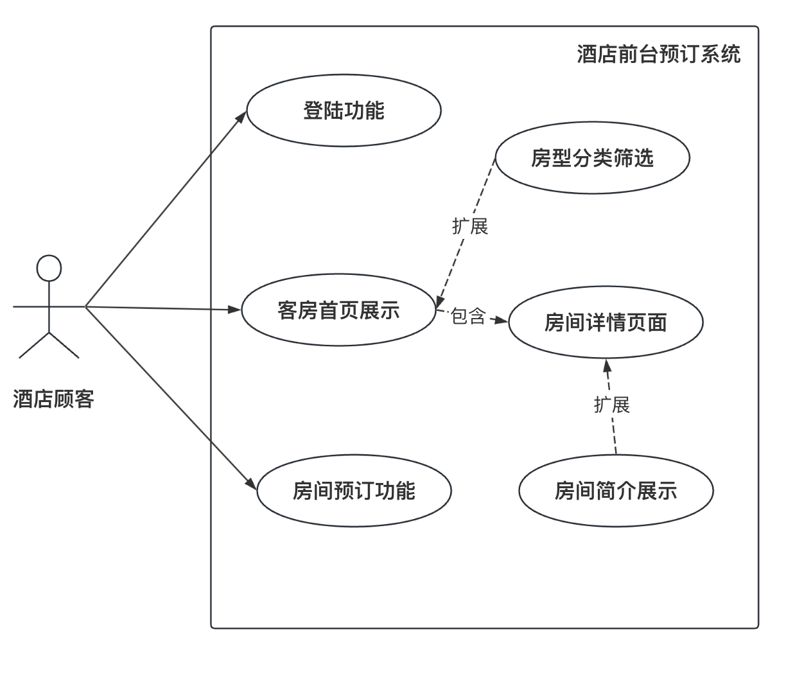

<h1>
需求分析报告
</h1>

| 修改人 | 修改内容                        | 修改原因         | 版本信息 | 修改日期 |
| ------ | ------------------------------- | ---------------- | -------- | -------- |
| 李博   | 创建需求分析初稿大纲            | -                | v1.0     | 2024/6/1 |
| 李博   | 完成第1/2/4部分以及功能需求部分 | 完善需求分析过程 | v1.1     | 2024/6/2 |
| 李佳乐 | 完成非功能需求部分              | 完善需求分析过程 | v1.2     | 2024/6/5 |

### 1. 引言

#### 1.1 编写目的

编写本文档是进行 **酒店前台预订和后台管理系统** 开发的前置步骤，这是在项目初期根据需求的调研和分析所完成的。核心目的是为系统项目的开发提供需求分析规格说明，主要有以下两条：

+ 阐述相关的功能,性能,接口和可靠性的要求,，作为开发成员进行设计和编码的基础。
+ 作为酒店相关方客户测试和确认的依据和验收标准。

#### 1.2 预期读者及建议

| 编号 | 预期读者        | 阅读建议                                                 |
| ---- | --------------- | -------------------------------------------------------- |
| 1    | 客户-酒店方     | 对文档中给出的需求描述（尤其是功能性需求）进行评审和确认 |
| 2    | 开发方-小组成员 | 熟悉并掌握项目的需求，按照需求进行酒店系统的开发         |
| 3    | 监督方-老师     | 监督和评审需求分析的合理性、完善性                       |

### 2. 项目概述

#### 2.1 项目背景

+ 随着旅游业和酒店行业的迅猛发展，酒店预定管理系统成为了提高酒店运营效率、提供更好客户体验的关键工具。传统的酒店管理方式依赖于传统媒介或者离线系统已经难以应对日益复杂化以及线上化的业务需求。由于适应了行业的发展趋势，线上化的酒店前台预定和后台管理的系统非常受到企业和用户的欢迎。一款先进的酒店预定管理系统，为酒店产业提供了一套全面、高效、智能的解决方案，为推动酒店业的数字化转型、提升整个行业的竞争力作出积极贡献。
+ 在本次课程中，我们小组选择设计和实现一个前后端分离的酒店前台预订和后台管理系统，并以此作为一次有效的软件工程实践，试图提供一个前后台分离的、界面舒适简介、操作易用合理的web应用。

#### 2.2 项目目标

+ **开发一个支持用户前台预订房间、管理员后台进行订单管理的美观、易用、具有可扩展性的酒店系统，以提高用户的订房体验并简化管理员的操作效率。**

### ==3. 系统需求分析==

#### 3.1 功能需求分析

##### 3.1.1 用户角色与权限

在一个基本的酒店预定和管理系统中，有多种角色用户类型。在本项目中，定义了两种用户角色：酒店管理员和酒店顾客。

+ **酒店顾客的权限包括：**预订界面需要美观简洁、可以直观了解到房间的存量、外观、价格、简介等信息；顾客可以使用有效的用户名和密码登录酒店的前台预定系统；顾客可以浏览可用房间的详细信息，包括房间类型、价格、简介；顾客可以选择并预订可用的房间。
+ **酒店管理员的权限包括**：需要方便、高效、安全地访问和管理酒店系统的房间、订单、用户信息；管理员可以使用专用的用户名和密码账户登录酒店的后台管理系统；管理员可以添加、修改和删除系统中的用户，包括其他管理员和顾客；管理员可以添加、修改和删除酒店房间的信息，包括房间类型、价格、标签等；管理员可以查看所有订单的状态等。

##### 3.1.2 前台预订系统

+ **客房首页展示**：房型分类，使用户轻松找到对应需求房间；在首页清晰标注房间价格以及房间真实图片，保障用户知情。
+ **房间详情页面**：对于每个房间提供详细的房间简介，使用户可以更了解每个房间；在详情页面中体现房间的状态信息即是否可预订。

- **房间预订功能**：用户可以对房间进行预订。
- **UML用例图：**

##### 3.1.3 后台管理系统

+ **安全登录功能**：只有管理员账号能够进入后台管理系统，确保安全性。

+ **酒店管理功能**：包括客房房间管理、房型管理和标签管理。

- **用户管理**：提供添加、修改和删除用户的功能，以维护系统用户信息。
- **订单管理**：管理员可以查看和编辑订单信息，确保订单的准确性
- **日志管理：**显示系统的登陆IP和时间。
- **UML用例图：**

#### 3.2 非功能需求分析

> 除了功能需求，还需要明确系统的非功能需求，这包括性能、可维护性、安全性、可用性等方面的要求。这些非功能需求的明确定义有助于确保系统在各个方面都满足要求。

##### 3.2.1 性能需求

+ **响应时间**：系统在高峰时段的响应时间应不超过2秒，以确保用户在访问和操作时获得良好的体验。
+ **吞吐量**：系统应支持至少1000个同时在线用户，以满足高并发的需求。
+ **数据库访问**：在高峰时段，系统应能保持数据库访问的稳定性，避免因频繁的读写操作导致系统崩溃。
+ **延迟和异步请求**：系统应优化延迟，利用异步请求技术提升数据处理速度，确保在高负载下依然能快速响应用户请求。

##### 3.2.2 可维护性需求

+ **代码结构**：代码应遵循清晰的编写规范和风格，注释详细，便于其他开发者理解和维护。
+ **开发文档和用户手册**：提供详细的开发文档和用户手册，帮助开发者快速上手和用户正确使用系统。
+ **系统模块化**：采用模块化设计，使得系统各个功能模块相对独立，便于扩展与维护。具体包括前后端分离、用户页面和后台各模块的划分。
+ **单页面应用**：通过单页面应用（SPA）实现无刷新加载，提高用户体验和系统响应速度。
+ **样式维护**：使用Less预处理器定义样式，使得样式代码更加清晰、易维护。
+ **设计模式**：采用MTV（Model-Template-View）设计模式，提升系统的可维护性。
+ **自动化部署**：系统应支持自动化部署工具，如CI/CD管道，确保代码在多个环境中的一致性，并减少人为错误。
+ **可配置性**：系统应尽量减少硬编码，使用配置文件或数据库存储可变参数，以便于在不同环境中快速部署和配置。
+ **可扩展架构**：系统应采用可扩展的架构设计，便于在将来添加新功能或模块，而不影响现有系统的稳定性。

##### 3.2.3 安全性需求

安全性需求主要包括数据传输加密、身份验证和权限管理：

+ **数据加密**：使用SSL/TLS协议进行数据传输加密，确保数据在传输过程中的安全性。
+ **身份验证**：支持多因素认证，增强用户登录的安全性。在登录表单中，提供账号和密码输入框，采用Ant Design的a-input组件。使用a-form进行表单验证，确保数据完整性。登录按钮使用a-button组件，提供loading状态，防止重复点击。
+ **权限管理**：设立详细的权限管理和访问控制系统，确保不同用户只能访问其授权范围内的资源。包括用户日志记录和管理员权限管理，以便监控和管理用户行为。

##### 3.2.4 可用性需求

+ **系统可靠性**：系统全年可用时间应不低于99.9%，以确保系统的高可用性。
+ **自动故障转移和数据恢复**：支持自动故障转移和数据恢复机制，确保在系统故障时能够迅速恢复，减少对用户的影响。
+ **友好用户界面**：前台预订页面使用友好的用户界面以提升用户的预订体验，可以使用合适的前段框架和UI。

#### 3.3 数据管理要求

##### 3.3.1 数据存储

+ **数据库选择**：使用流行的关系型数据库例如mysql进行数据的永久存储，确保数据的一致性和完整性。可以使用redis等缓存加快访问速度。
+ **数据建模**：设计合理的数据库模型，确保各表之间的关系清晰，避免数据冗余。

##### 3.3.2 数据安全

+ **加密存储**：使用加密算法存储敏感数据，如酒店顾客密码和管理员密码等。

##### 3.3.3 数据备份和恢复策略

+ **定期备份**：实现自动化备份机制，定期对数据库进行备份。
+ **灾难恢复**：制定详细的灾难恢复方案，确保在数据丢失或损坏时能够快速恢复。

#### 3.4 故障处理要求

##### 3.4.1 故障检测

+ **实时监控**：系统应具备实时监控功能，监控服务器状态、应用性能、数据库状态等关键指标。
+ **日志记录**：系统应记录详细的运行日志和错误日志，包括时间戳、错误类型、错误详细信息等。
+ **自动报警**：系统应配置自动报警机制，在检测到异常情况时，通过邮件、短信、即时消息等方式通知相关维护人员。

##### 3.4.2 故障处理

+ **故障分类**：系统应对故障进行分类（如关键故障、一般故障、轻微故障），并制定相应的处理流程。
+ **故障排查**：系统应提供故障排查工具和方法，帮助维护人员迅速定位故障原因。
+ **故障修复**：系统应具备快速修复故障的能力，优先处理影响用户使用的关键故障，确保系统尽快恢复正常运行。

##### 3.4.3 故障恢复

+ **数据恢复**：在发生数据丢失或损坏时，系统应具备数据恢复能力，确保数据的完整性和一致性。系统应配置定期备份机制，并提供备份数据的快速恢复方法。
+ **服务恢复**：在发生系统故障时，系统应具备快速恢复服务的能力，确保最小化服务中断时间。系统应配置冗余机制和高可用架构，确保在发生故障时能够快速切换到备用系统。

##### 3.4.4 用户通知

+ **用户通知机制**：在发生影响用户使用的故障时，系统应及时通知用户，包括故障类型、预计恢复时间等信息。通知方式可以包括邮件、短信、网站公告等。
+ **用户反馈机制**：系统应提供用户反馈机制，用户可以报告遇到的故障和问题，维护人员应及时响应和处理用户反馈。

### 4. 需求优先级

> 需求优先级直接决定了开发的优先顺序以及客户的要求高低。

| 需求             | 优先级 |
| ---------------- | ------ |
| **前台预订系统** |        |
| 客房首页展示     | 高     |
| 房间详情页面     | 高     |
| 房间预订功能     | 高     |
| **后台管理系统** |        |
| 安全登录功能     | 高     |
| 客房房间管理     | 中     |
| 房型管理         | 中     |
| 标签管理         | 低     |
| 用户管理         | 中     |
| 订单管理         | 中     |
| 日志管理         | 低     |

+ 说明：
	1. **前台预订系统**：
		- **客房首页展示**、**房间详情页面**、**房间预订功能**：这些功能直接影响用户体验，是前台系统的核心功能，因此优先级为高。
	2. **后台管理系统**：
		- **安全登录功能**：保障系统的安全性，是后台管理的前提条件，因此优先级为高。
		- **客房房间管理**、**房型管理**：管理员需要通过这些功能来管理房间和房型信息，保持数据的准确性，因此优先级为中。
		- **用户管理**、**订单管理**：确保系统用户信息和订单信息的正确性和及时更新，优先级为中。
		- **标签管理**、**日志管理**：这些功能对系统的影响较小，属于辅助功能，因此优先级为低。

### 5. 风险分析

| 风险       | 描述                                                         | 应对措施                                                     |
| ---------- | ------------------------------------------------------------ | ------------------------------------------------------------ |
| 数据泄露   | 用户预订信息和支付信息可能被未授权方访问、篡改或盗取。       | 实施严格的数据加密和权限管理，定期审计。                     |
| 系统崩溃   | 高并发预订操作可能导致系统无法承受负载，导致系统崩溃或服务不可用。 | 优化系统性能，进行压力测试，增加服务器负载均衡和扩展。       |
| 数据丢失   | 数据库故障或人为错误可能导致预订和用户数据丢失。             | 定期进行数据备份，制定详细的数据恢复计划。                   |
| 法规遵从   | 系统可能违反数据保护法规或其他相关法律，导致法律风险。       | 定期审查法规要求，确保系统设计和操作符合相关法律法规。       |
| 用户体验差 | 系统响应慢或界面设计不合理，导致用户体验下降，影响用户满意度。 | 进行用户体验测试，收集用户反馈，优化系统响应时间和界面设计。 |
| 运维困难   | 系统运维过程中可能遇到难以解决的问题，影响系统稳定运行。     | 提供详细的运维文档，培训运维人员，确保能处理运维问题。       |
| 依赖失效   | 依赖的第三方服务或库失效或停止支持，导致系统功能受限或无法运行。 | 定期检查依赖项，确保其更新和支持，准备替代方案。             |

